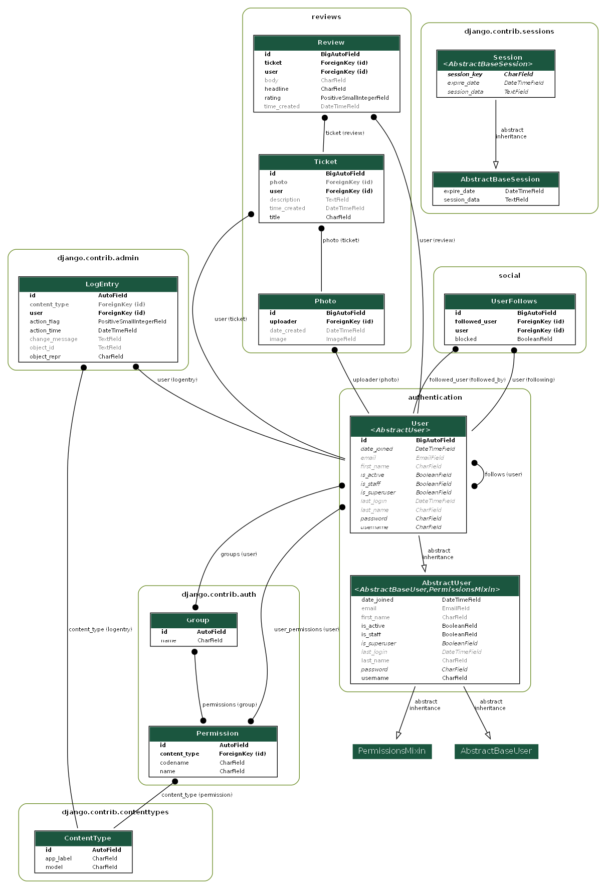

# Project 9 : LitReview

## Description
LitReview is a Django-based web application designed to allow users to write, publish, and manage reviews of books and articles.   
It also supports social features such as following other users and interacting with reviews.


## Prerequisites
 - Python 3.x installed on your machine
 - Clone this repository :
```bash
 git clone https://github.com/SallyPJ/ocp9.git
```
   
## Installation
- Open the main folder
```bash
cd ocp9
```
- Create a virtual environment 
```bash
python -m venv venv
```
- Activate the virtual environment
  - Windows(Powershell)
  ```bash
  venv\Scripts\activate
  ```
   - Linux/Mac
  ```bash
  source env/bin/activate
  ```
 - Install dependencies
```bash
 pip install -r requirements.txt
```
- Go to the project folder
```bash
cd LitReview
```
- Run the server
```bash
 python manage.py runserver
```
 - Open the following address in your browser : http://127.0.0.1:8000/

## Usage
- **User account management**
  - User can create an account.
  - User can login and logout if they have an account.
- **Create and manage requests:** 
  - Users can create review requests (tickets).
  - Tickets include a title (required), description, and an image
  - User can modify or delete his own tickets.
  - Deleting a ticket will also delete all associated reviews.
- **Write Reviews for Requests** 
  - Users can respond to a ticket by posting a review (one per ticket). 
  - Reviews include a title (required), a rating, and a description.
  - User can modify or delete his own reviews.
- **Follow Other Users** 
  - Users can search for other users by username.
  - Users can follow or unfollow other users.
  - Users can block or unblock other users.
- **News Feed:** 
  - User have access to a feed that displays tickets and reviews written by the user and from people they follow.
  - Reviews on user's tickets from people not followed by the user are also displyed on the feed.
  - Posts from blocked users are not displayed on the feed 
  - The feed display 6 posts per page.

## Test Users
To simplify the testing process, the application comes with predefined user accounts.   
Use these credentials to explore the app:

| Username   | Password  | Role / Description                                       |
|------------|-----------|----------------------------------------------------------|
| test_user1 | ocp9user1 | Regular user, follows test_user2 and test_user3          |
| test_user2 | ocp9user2 | Regular user, follows test_user1, has blocked test_user3 |
| test_user3 | ocp9user3 | Regular user, follows test_user1 and test_user2          |
| admin      | admin     | Admin account with full permissions, follows test_user1  |
### How to Access

- Go to the login page: http://127.0.0.1:8000/ or http://127.0.0.1:8000/admin (admin account only).
- Use one of the above credentials to log in.
- Explore the features based on the user role.

## Technical architecture

### Apps

- authentication: Handles user authentication and registration.

- reviews: Manages review creation, updates, and deletion.

- social: Implements social interactions such as following/unfollowing users.

### Data relationships

## License
This project is licensed under the MIT License. See the LICENSE file for more information.
